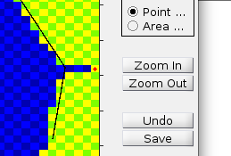

# ROMS_AGRIF Installation Ubuntu 17.04

## Installation of Roms_tools

Download ROMS_AGRIF

[ROMS_AGRIF v3.1.1](ftp://ftp.legos.obs-mip.fr/pub/romsagrif/DATA_ROMS/CODE/Roms_Agrif_v3.1.1_07_07_2014.tar.gz)

Uncompress tar

    tar -zxvf Roms_Agrif_v3.1.1_07_07_2014.tar.gz

this will create a folder named `Roms_tools`. Download ROMSTOOLS

[ROMSTOOLS v3.1.1](ftp://ftp.legos.obs-mip.fr/pub/romsagrif/DATA_ROMS/TOOLS/ROMSTOOLS_v3.1.1_07_07_2014.tar.gz)

and uncompress these tools into the `Roms_tools` folder:

    tar -zxvf ROMSTOOLS_v3.1.1_07_07_2014.tar.gz

Download the toolboxes and softwares nedded by ROMSTOOLS

[Utilities](ftp://ftp.legos.obs-mip.fr/pub/romsagrif/DATA_ROMS/UTILITIES/Utilities_ROMSTOOLS_v3.0_21_12_2012.tar.gz)

and uncompress them:

    tar -zxvf Utilities_ROMSTOOLS_v3.0_21_12_2012.tar.gz

Copy and renamed `Run` folder:

    cd Roms_tools
    cp Run Run_whatever

Install required `netcdf` libraries:

    sudo apt install netcdf-bin libnetcdf-dev libnetcdff-dev

## Creation of required initial files

You will need download the needed datasets to create the required initial conditions.
These datasets ar in the CROCO Datasets website
[http://www.croco-ocean.org/download/datasets/](http://www.croco-ocean.org/download/datasets/)

### Grid creation

Open Matlab and add `Run_whatever` folder:

```
>> cd Run_whatever
>> start
```

execute `make_grid` to create netcdf with grid. To do this, we'll need the `etopo2.nc` file.

[Topo](ftp://ftp.legos.obs-mip.fr/pub/romsagrif/DATA_ROMS/Topo_26_05_2004.tar.gz)

Once you get the `etopo2.nc` put this in the path:

    Roms_tools/Topo/etopo2.nc

and then:

```
>> make_grid
```

> If this error appears
> Undefined function or variable 'bitmax'.
> open in Matlab the m_grid.m file and replace every bitmax by flintmax

### Surface boundary initial conditions
To make the forcing conditions, first we must get the needed netcdf files.

[COADS05](ftp://ftp.legos.obs-mip.fr/pub/romsagrif/DATA_ROMS/COADS05_2006_10_25.tar.gz)

extract file into the `Roms_tools` and execute:

```
>> make_forcing
```

###  Temperature and Salinity initial conditions
First, download the needed datasets. In this case get the CARS2009 dataset

[CARS2009](ftp://ftp.legos.obs-mip.fr/pub/romsagrif/DATA_ROMS/CARS2009_02_10_2013.tar.gz)

or

[WOA2009](ftp://ftp.legos.obs-mip.fr/pub/romsagrif/DATA_ROMS/WOA2009_24_06_2011.tar.gz)

extract into the `Roms_tools` and then execute:

```
>> make_ini
```

> We can execute the make_ini using CARS2009 or WOA2009. We can change the climate files
> modifying the romstools_param.h:
>         %climato_dir=cars2009_dir;
>         climato_dir=woa_dir;  % Select this to use the WOAPISCES

### Temperature and salinity boundary and initial condition
To execute this, only:

```
>> make_clim
```

## Compilation of model and running
After the execution of the last 4 steps, we'll have 4 `netcdf` files into the `ROMS_FILES` folder:

* roms_clm.nc
* roms_frc.nc
* roms_grd.nc
* roms_ini.nc

and other intermediate files not needed to get the model.

### Compilation in local (ONLY Linux)

Modify `jobcomp` file into the `Run_whatever` folder to use `lnetcdff`, adding:

    ...
    # If needed set your own NETCDF directories
    #
    NETCDFLIB="-L../../netcdf_x86_64 -lnetcdff"
    ...

and execute:

    ./jobcomp

after the compilation finish, then execute the model:

    ./roms roms.in

##### Running with Intel compiler

First, you'll need install the Intel Fortran Compiler into the machine.

Get the Intel software in Student version from [Intel Web](https://software.intel.com/en-us/parallel-studio-xe/choose-download/student-linux-fortran)

Change the Linux compiler to the Intel compiler

    LINUX_FC = ifc

then in the `jobcomp` file we must change flag options where `$LINUX_FC=ifort || $LINUX_FC=ifc`

    FFLAGS1="-03 -xAVX -72 -fno-alias -i4 -r8"

To use the multiproccessing calculation we must change in the `cppdefs.h`

    define OPENMP

### Compilation in "Carlos Cloud"

#### Connecting from Windows

We'll needed:

* Putty
* WinSCP

With WinSCP we can copy the `nc` files from our `Run_whatever/ROMS_FILES` folder to our `rfirst/ROMS_FILES`
or whatever in the computer of Carlos (**CC**). Then we must copy our configuration files too:
* `params.h`
* `cppdefs.h`
in the `rfirst` folder

Then we must use Putty to connect us
to the CC and launch the compilation of the model. To do this:

    jobcomp

and after this finish

    roms roms.in

If we want launch the model and get out from the console, we can execute:

    nohup roms roms.in > roms.out & 2>&1 &

this launch a process and return us a PID, or the number of the process. We can show
the process running with:

    ps

Once the model is created, then you must download the `nc` files to your computer. To do this, you can use
WinSCP.

> To get CC credentials, contact with Carlos

### Configuring the model
After we execute `make_grid` we'll obtain the `LLm` and `MMm` parameters that we must copy
in the `params.h` file.

* theta_s: more layers close to the surface
* theta_b: more layers close to the bottom
* hc: the minimmun depth of the model

To run `zlevs`:

    depth=zlevs(100, 0, 5, 0, 10, 30, 'r', 2)

`r` is the point in the Arakawa cell. It could be `r`, the center of the cell or `w` the top of the cell
`vtransform` allow define the way the layer grow from coast to offshore. There are only two values `1` or `2`

## Nesting grids
To nest a smallest grid into our model in Matlab,

    >> nestgui


select the parent grid, in our case `roms_grd.nc` into de `ROMS_FILES` folder. Click in the
`Define child` button and select with the mouse the child grid area into the window opened.

With `New child topo` we could select a new high resolution topography to the child.
`Match volume` allow match the volume between child and mom. Only in cases that mom knows
the child topo.

`r-factor` indicates the depth relation between cells. Shoudn't be bigger than 20%.
`n-band` in the boundary between mom and child the values must be identical. This value
allow set how many cells are the boundary between them.
`Hmin` set the minimmun depth to simplify the model. Only in cases where the bathimetry has
depths under this minimmun depth.

After we set the whole params, we have to get the

`refine coeff` set the refinement between mom and child grid. In the 99% cases this value
will be 3 for numeric stability. Is good that a mom cell is equal to a child cell.

We generate the `roms.in` from the gui and we can modify values into this file.

Clicking into the `Create AGRIF_FixedGrids.in` generates the values from the UI to a file
into the root folder.

Once all these files are created we can run the model:

* Open `cppdefs.h` and `define` the `AGRIF` and `AGRIF_2WAY` variables
* run `jobcomp`
* and then `roms roms.in`

## Generating Rivers
`clobber` removes the file if it exits.

`redef` allow us define the attributes of the netcdf file. The order to define its if:
* Global attributes
* Dimensions
* Variables and attributes

### Global attributes

    %% Global attributes:
    nc.title = ncchar('River file to use with ROMS');
    nc.title = 'River file to use with ROMS';
    nc.type = ncchar('ROMS river file');
    nc.type = 'ROMS river file';

### Dimensions

    %% Dimensions:

    nc('qbar_time') = nd;
    nc('temp_src_time') = nd;
    nc('salt_src_time') = nd;
    nc('n_riv') = nr;
    nc('RivnameStrLen') = 14;

### Variables and attributes

    %% Variables and attributes:

    nc{'qbar_time'} = ncdouble('qbar_time'); %% 12 elements.
    nc{'qbar_time'}.long_name = ncchar('river runoff time');
    nc{'qbar_time'}.units = ncchar('days');
    nc{'qbar_time'}.cycle_length = ncdouble(36500);

    nc{'temp_src_time'} = ncdouble('temp_src_time'); %% 12 elements.
    nc{'temp_src_time'}.long_name = ncchar('river temperature time');
    nc{'temp_src_time'}.units = ncchar('days');
    nc{'temp_src_time'}.cycle_length = ncdouble(36500);

    nc{'salt_src_time'} = ncdouble('salt_src_time'); %% 12 elements.
    nc{'salt_src_time'}.long_name = ncchar('river salinity time');
    nc{'salt_src_time'}.units = ncchar('days');
    nc{'salt_src_time'}.cycle_length = ncdouble(36500);

    nc{'Qbar'} = ncdouble('n_riv', 'qbar_time'); %% 36 elements.
    nc{'Qbar'}.long_name = ncchar('river runoff time');
    nc{'Qbar'}.units = ncchar('m3/s');

    nc{'temp_src'} = ncdouble('n_riv', 'qbar_time'); %% 36 elements.
    nc{'temp_src'}.long_name = ncchar('river temperature time');
    nc{'temp_src'}.units = ncchar('ºC');

    nc{'salt_src'} = ncdouble('n_riv', 'qbar_time'); %% 36 elements.
    nc{'salt_src'}.long_name = ncchar('river salinity time');
    nc{'salt_src'}.units = ncchar('psu');

    nc{'riv_name'} = ncchar('n_riv', 'RivnameStrLen'); %% 6 elements.
    nc{'riv_name'}.long_name = ncchar('river runoff time');

`endef` and `close` to save these data into the file.

Then we could generate the data to populate the file.

To add the river to the model, we need open the mask generated after the `make_grid` execution.
Then we must draw 3 cells in the exact point where we want add the river. Get the exact location
in cell location units to put them in the `roms.in` file.

If river flows to west or south you must take the cell in land.



for rivers flowing to east or north you have to define the river in the water cell.


    psource_ncfile:   Nsrc  Isrc  Jsrc  Dsrc qbardir  Lsrc  Tsrc   runoff file name
                                      ROMS_FILES/roms_rivers.nc
                     1
                            56  46  0  -1   30*T   5.0  0.0

In the `cppdefs.h` set `define` to the `PSOURCE` and `PSOURCE_NCFILE` variables.

## Make in zoom in
With the `axis([minX maxX minY maxY minZ maxZ])` we can manage the zoom into the model.
Introducing setting axis into the loop and adding time to the `minX` and `minY` we can
show a zoom to the point.

## Changing winds state
See the nc forcing file and the wind variables appears:

    nc{'sustr'}
    nc{'svstr'}

and we can modify the value in we are interested, one month of north winds, one week or whatever.
We must know the relation between thc wind velocity and the streess caused by this wind on
the ocean surface. There is equations to solve this issue. Aprox 10m/s will be 0.1N/m2.

Open the file in write mode:

      nc=netcdf('ROMS_FILES/roms_frc.nc', 'w');
      nc{'sustr'}(:,:,:)=0
      nc{'svstr'}(:,:,:)=-.1

      close(nc)

## Tides
Run:

      >> make_tides

We need define location and date into the 'romstools_param.m':

    %%%%%%%%%%%%%%%%%%%%%%%%%%%%%%%%%%%%%%%%%%%%%%%%%%%%%%%%%%%%%%%%%%%%%%%
    %
    % 5 - Parameters for tidal forcing
    %
    %%%%%%%%%%%%%%%%%%%%%%%%%%%%%%%%%%%%%%%%%%%%%%%%%%%%%%%%%%%%%%%%%%%%%%%
    %
    % TPXO file name (TPXO6 or TPXO7)
    %
    tidename=[DATADIR,'TPXO7/TPXO7.nc'];
    %
    % Number of tides component to process
    %
    Ntides=10;
    %
    % Chose order from the rank in the TPXO file :
    % "M2 S2 N2 K2 K1 O1 P1 Q1 Mf Mm"
    % " 1  2  3  4  5  6  7  8  9 10"
    %
    tidalrank=[1 2 3 4 5 6 7 8 9 10];
    %
    % Compare with tidegauge observations
    %
    lon0 =  18.37;   % Example:
    lat0 = -33.91;   % Cape Town location
    Z0   =  1;       % Mean depth of tide gauge
    %

and `define TIDES` variable in the `cppdefs.h` file.

<a rel="license" href="http://creativecommons.org/licenses/by-sa/4.0/"></a><br />This work is licensed under a <a rel="license" href="http://creativecommons.org/licenses/by-sa/4.0/">Creative Commons Attribution-ShareAlike 4.0 International License</a>.